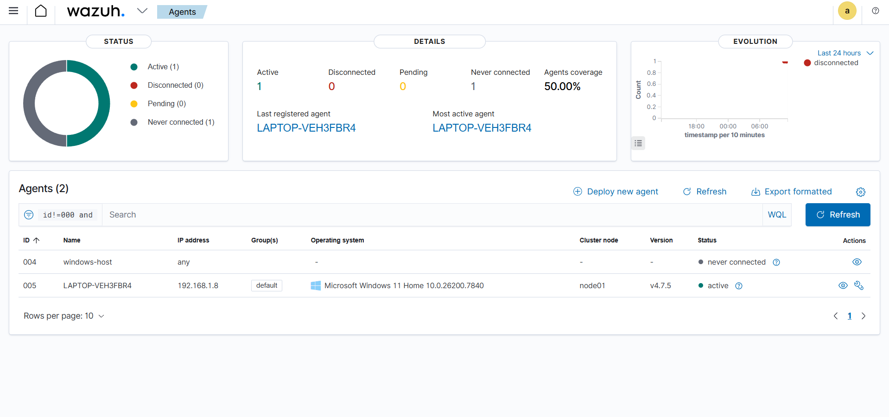
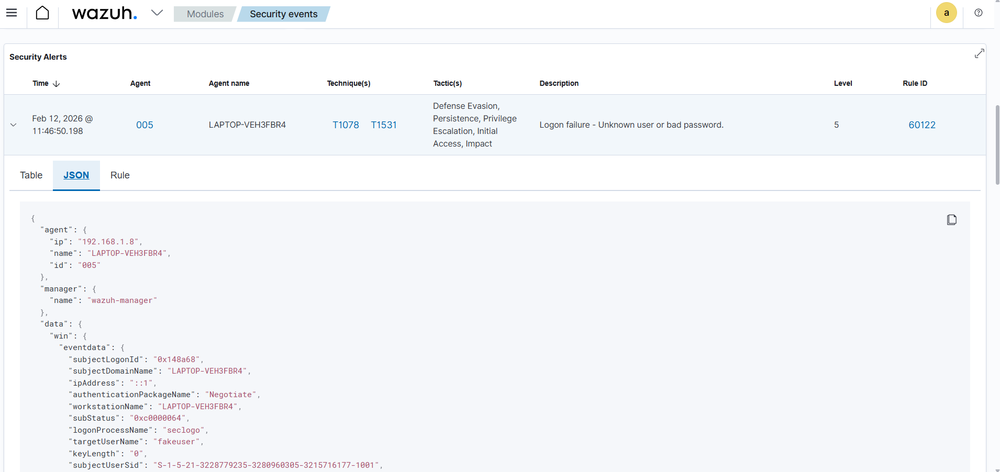

# SOC Home Lab — SIEM Monitoring, Detection Engineering & Alert Triage

A hands-on portfolio project focused on real SOC (Security Operations Center) Tier 1 workflows:  
log ingestion, alert validation, triage, and investigation-driven decision making.

---

## Analyst Role Simulation

In this lab, I operated as a SOC Tier 1 analyst responsible for monitoring endpoint telemetry, validating alerts, and performing investigation-driven analysis.

Activities were approached using real SOC workflows including alert triage, hypothesis validation, and evidence-based decision making.

## Project Objective

Reading about SOC operations is easy. Demonstrating practical ability is not.

This repository showcases how I approach real SOC Tier 1 activities, with emphasis on:

- Verifying data sources and log ingestion
- Validating alerts end-to-end
- Performing structured alert triage
- Investigating authentication and privilege-related events
- Documenting findings clearly and methodically

The focus is on process, reasoning, and validation — not just tool installation.

---

## Architecture

This lab simulates a realistic SOC-style monitoring architecture:

- **Wazuh Manager (All-in-One)** running on Ubuntu (Oracle VirtualBox)
- **OpenSearch** for indexing and search
- **OpenSearch Dashboards** for alert visualization and investigation
- **Filebeat (Wazuh module)** for structured log ingestion
- **Windows 11 endpoint** with Wazuh Agent installed

This architecture mirrors common entry-level SOC environments focused on host-based telemetry and centralized monitoring.

---

## Monitoring Scope

The lab collects and validates real endpoint telemetry, including:

- Windows authentication activity (Event ID 4624 / 4625)
- Failed logon detection and validation
- Privilege-related activity
- Agent heartbeat and connectivity monitoring
- Host-based event logs (Security, System, Application)

Alerts are enriched with:

- MITRE ATT&CK technique mapping
- Compliance metadata (e.g., PCI DSS, GDPR) when available

---

## 🎯 MITRE ATT&CK Mapping

| Technique | ID | Tactic |
|-----------|-----|--------|
| Brute Force: Password Guessing | [T1110.001](https://attack.mitre.org/techniques/T1110/001/) | Credential Access (TA0006) |
| Valid Accounts | [T1078](https://attack.mitre.org/techniques/T1078/) | Defense Evasion / Persistence |
| OS Credential Dumping | [T1003](https://attack.mitre.org/techniques/T1003/) | Credential Access (TA0006) |

---

## Detection Validation Example

To validate ingestion and detection capabilities:

- A failed authentication attempt was simulated using `runas /user:fakeuser cmd`
- This generated a Windows Security Event ID 4625 (Logon Failure).
- Wazuh successfully ingested the event and generated a Level 5 alert.
- The alert was mapped to relevant MITRE ATT&CK techniques.

This confirms:

- Proper Windows Event Channel ingestion
- Detection rule triggering
- Field parsing and normalization
- End-to-end data flow from endpoint to SIEM

### 📸 Evidence

**Agent connected — Wazuh Dashboard:**

**Failed login detection — Event ID 4625:**

---

## Case Studies (SOC Investigation Examples)

This repository includes practical SOC-style investigations demonstrating alert triage and analytical reasoning.

- [Case Study 01 — Failed Logon Investigation (Event ID 4625)](case-studies/brute-force-investigation.md)

Each case study documents the investigation workflow followed by a SOC Tier 1 analyst, including triage, analysis, and decision-making.

## SOC Activities Demonstrated

This project includes hands-on execution of:

- Endpoint onboarding (agent deployment and connectivity validation)
- Log ingestion verification and troubleshooting
- Alert triage using contextual metadata
- Authentication event investigation
- Detection validation through simulated adversarial behavior
- Service and permission troubleshooting
- Index and data flow validation in OpenSearch

The emphasis is on understanding *why* alerts are generated and how to validate them.

---

## Tools & Technologies

- **SIEM:** Wazuh
- **HIDS:** Wazuh Agent
- **Search & Indexing:** OpenSearch
- **Log Shipping:** Filebeat (Wazuh module)
- **Operating Systems:** Ubuntu (VirtualBox), Windows 11
- **Virtualization:** Oracle VirtualBox
- **Framework:** MITRE ATT&CK

---

## Design Decisions

The lab uses the official Wazuh Filebeat module for ingestion instead of custom pipelines in order to:

- Reduce configuration drift
- Improve maintainability
- Better reflect production-style SOC environments

Configuration remains aligned with best practices for entry-level monitoring setups.

---

## Repository Structure

    screenshots/     → Evidence of agent connectivity and alert validation
    troubleshooting/ → Log ingestion and configuration troubleshooting documentation
    case-studies/    → SOC investigation write-ups

Screenshots do not contain credentials or sensitive host information.

---

## Troubleshooting & Validation

Real SOC work involves identifying and resolving ingestion and visibility issues.

During this lab build, the following issues were encountered and resolved:

- Windows Security log ingestion misconfiguration
- Event channel parsing validation
- Agent connectivity validation
- Index visibility and data verification in OpenSearch
- Configuration syntax errors in ossec.conf
- End-to-end data flow validation

The full troubleshooting documentation is available in the `troubleshooting/` directory.

---

## Current Status

✔ Core monitoring implemented  
✔ Ingestion validation completed  
✔ Failed authentication detection validated  
✔ Alert triage workflow demonstrated  
✔ Case study documented (Event ID 4625 investigation)

### Next Steps

- Additional endpoint simulation scenarios
- Expanded detection rule coverage with custom Wazuh rules
- Network-based telemetry integration

---

## Disclaimer

This project is for educational and portfolio purposes only.  
No production systems or sensitive data are involved.

---

## 🔗 Related Projects

| Project | Description |
|---------|-------------|
| [splunk-brute-force-detection](https://github.com/AurelioAvila/splunk-brute-force-detection) | Brute force detection with Splunk SPL |
| [malware-triage-hash](https://github.com/AurelioAvila/malware-triage-hash) | Python tool for malware triage via VirusTotal API |
| [phishing-email-analysis](https://github.com/AurelioAvila/phishing-email-analysis) | Email header parser and IOC extractor |
